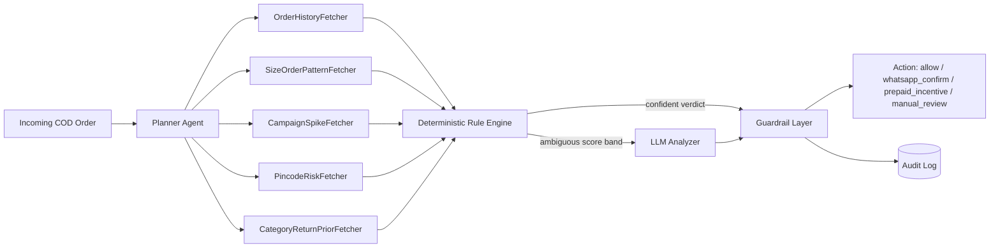

# ReturnGuard AI

> Fashion-aware RTO (Return-to-Origin) risk & intervention agent — a multi-agent
> plug-in designed to sit on top of a generic COD risk model, adding fashion-specific
> signals (multi-size ordering, campaign spikes, category/fabric return priors) that a
> generic model doesn't see.

📄 [Problem Statement](docs/PROBLEM_STATEMENT.md) · 🏗️ [Architecture Deep-dive](docs/ARCHITECTURE.md)

## How it works



**Rules first, LLM only when needed.** The deterministic rule engine resolves
clear-cut orders (blacklisted pincode, multi-size pattern, serial returner) without
ever calling an LLM. Only the genuinely ambiguous cases reach the LLM Analyzer — and
even then, a guardrail layer validates the action, caps discounts, and logs everything.

## Project structure

```
returnguard-ai/
├── backend/
│   ├── main.py                 # FastAPI app entrypoint
│   ├── config.py                # env-driven settings
│   ├── models/schemas.py        # Pydantic request/response/trace models
│   ├── data/
│   │   ├── mock_providers.py    # mock pincode/category/customer/campaign data
│   │   └── mock_orders.py       # sample orders for the demo
│   ├── agents/
│   │   ├── planner.py           # decides which fetchers apply to an order
│   │   ├── fetchers.py          # pulls order/pincode/category/campaign signals
│   │   ├── rule_engine.py       # deterministic hard rules, can short-circuit
│   │   ├── analyzer.py          # LLM reasoning for the ambiguous band only
│   │   ├── guardrails.py        # only place a final action is decided
│   │   └── pipeline.py          # orchestrates the full agent flow
│   ├── storage/audit_log.py     # append-only JSONL decision log
│   ├── api/routes.py            # REST endpoints
│   └── tests/                   # pytest unit tests
├── frontend/                    # static dashboard (no build step needed)
├── scripts/
│   ├── run_backend.sh           # venv + install + run the API + dashboard
│   └── seed_demo.py             # run the pipeline over sample orders from the CLI
├── docs/
│   ├── PROBLEM_STATEMENT.md
│   ├── ARCHITECTURE.md
│   └── VIDEO_SCRIPT.md
├── requirements.txt
└── .env.example
```

## Setup & run

Requires Python 3.10+. No Docker needed.

```bash
cd returnguard-ai
./scripts/run_backend.sh
```

This creates a virtualenv, installs dependencies, copies `.env.example` to `.env` if
missing, and starts the API + dashboard at **http://localhost:8000**.

If you'd rather run it manually:

```bash
python3 -m venv .venv
source .venv/bin/activate
pip install -r requirements.txt
cp .env.example .env
uvicorn backend.main:app --reload --port 8000
```

Open **http://localhost:8000** — that's the dashboard. Click **"Seed demo orders"**
to run the pipeline over 5 sample orders and watch the agent trace for each one
(which fetchers ran, the rule engine's score, whether the LLM analyzer was invoked,
and the guardrail's final decision).

### Running without an LLM key

`ANTHROPIC_API_KEY` in `.env` is optional. If it's unset, the Analyzer agent uses a
deterministic heuristic fallback for the ambiguous-band cases, so the entire pipeline
still runs end-to-end offline — useful for a demo without needing API credits.

### CLI-only demo (no server)

```bash
source .venv/bin/activate
python scripts/seed_demo.py
```

## API endpoints

| Method | Path | Purpose |
|---|---|---|
| POST | `/api/orders/evaluate` | Run the full agent pipeline on a single order |
| POST | `/api/orders/seed-demo` | Run the pipeline over the 5 bundled sample orders |
| GET | `/api/orders/{order_id}/trace` | Fetch the full decision trace for one order |
| GET | `/api/dashboard/stats` | Aggregate stats: action breakdown, LLM invocation rate |
| GET | `/api/dashboard/recent-traces` | Most recent decision traces |
| GET | `/health` | Health check |

Interactive API docs (Swagger) are auto-served at **http://localhost:8000/docs**.

## Running tests

```bash
source .venv/bin/activate
pytest backend/tests -v
```

Tests cover: rule-engine short-circuiting (blacklisted pincode, multi-size order,
serial returner, low-risk pass-through), guardrail clamping (discount ceiling,
unknown-action downgrade), and end-to-end pipeline runs over the sample orders.

## Design principles this project follows

- **Rules first, LLM only for the ambiguous middle** — most orders never reach the
  LLM; it's reserved for the score band the deterministic rules can't confidently
  resolve.
- **No agent acts directly** — the guardrail layer is the only place a final action
  is decided; it validates the action against an allow-list and clamps any discount
  to a hard ceiling (`MAX_DISCOUNT_PCT` in `.env`).
- **Full auditability** — every decision's complete trace (planner choices, fetcher
  outputs, rule score, analyzer rationale, guardrail notes) is persisted to
  `audit_log.jsonl` and retrievable via the API.
- **Provider-agnostic fetchers** — mock data providers back the fetchers today; swap
  `backend/data/mock_providers.py` for real integrations without touching the
  planner, rule engine, or pipeline.
