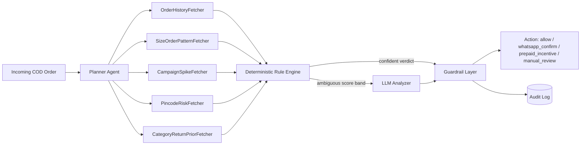

# Architecture — ReturnGuard AI

## Agent pipeline

## Components

| Component | File | Responsibility |
|---|---|---|
| Planner | `backend/agents/planner.py` | Decides which fetchers apply to this order |
| Fetchers | `backend/agents/fetchers.py` | Pull order/customer/campaign/pincode/category signals (mocked, provider-agnostic interface) |
| Rule Engine | `backend/agents/rule_engine.py` | Deterministic hard rules; can short-circuit to a verdict |
| Analyzer | `backend/agents/analyzer.py` | LLM reasoning over fetched signals, only for the ambiguous band; falls back to a deterministic heuristic if no LLM key is configured |
| Guardrails | `backend/agents/guardrails.py` | Clamps discount %, restricts to an allow-listed action set, never lets any layer act directly |
| Pipeline | `backend/agents/pipeline.py` | Orchestrates planner → fetchers → rules → analyzer → guardrails, builds the trace |
| Audit log | `backend/storage/audit_log.py` | Append-only JSONL log of every decision + full trace |
| API | `backend/api/routes.py`, `backend/main.py` | FastAPI surface: submit an order, fetch a trace, dashboard stats |
| Frontend | `frontend/` | Static dashboard: submit/seed orders, watch the live agent trace, see the guardrailed action |

## Decision flow

1. Rule engine runs first on every order. If it produces a **confident** verdict
   (`allow` or `manual_review` via a hard rule, e.g. blacklisted pincode, 3+ sizes of
   same SKU), that verdict goes straight to the guardrail layer — the LLM is never
   called.
2. Otherwise the rule engine emits a **risk score in the ambiguous band**, and the LLM
   Analyzer is invoked with the full fetched context to pick one action with a
   rationale.
3. The guardrail layer is the only place actions are finalized: it validates the
   action is in the allow-list, clamps any discount to `MAX_DISCOUNT_PCT`, and writes
   the full trace (planner decisions, fetcher outputs, rule scores, LLM rationale,
   final action) to the audit log.

## Why LLM calls are bounded

Most orders should never reach the LLM — the rule engine is designed to resolve the
majority of clear-cut cases (obviously fine, or obviously high-risk) deterministically
and cheaply. The LLM is reserved for the genuinely ambiguous middle, which keeps
latency and cost predictable and keeps the system auditable: a judge (or an incident
reviewer) can always point at exactly which layer made a given call.

## Extensibility

- Swap any `Fetcher` implementation for a real integration (shipping provider API,
  order management system, campaign/ads platform) without touching the pipeline.
- The rule engine's rules are plain Python predicates in a list — add/remove without
  touching orchestration.
- `analyzer.py` calls Anthropic's API if `ANTHROPIC_API_KEY` is set in the
  environment; otherwise it uses a deterministic stand-in so the whole pipeline still
  runs end-to-end offline for a demo.
